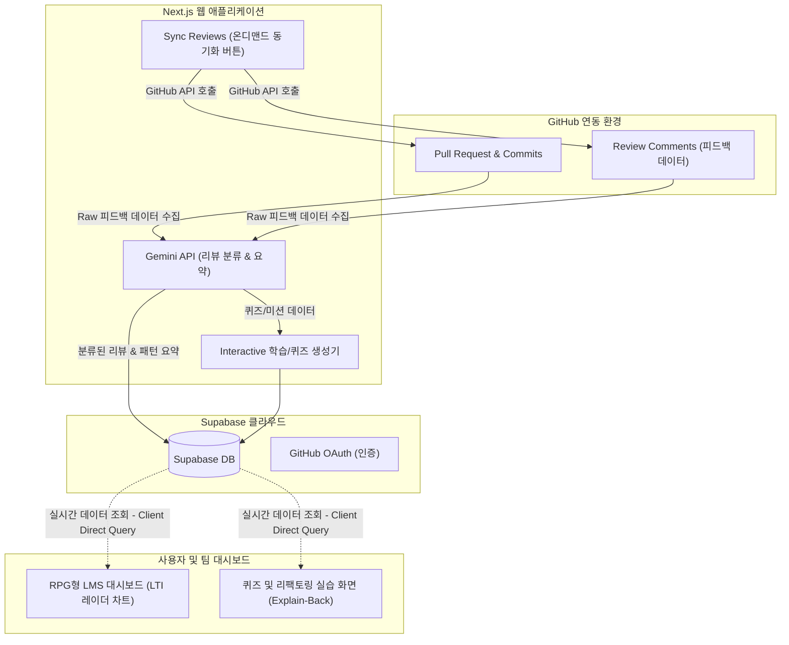

# [해커톤 아이디어 개발 기획서] GitTales (깃테일즈)
> AI 기반 실무 과제테스트 연습 및 1:1 피드백 플랫폼

---

## 📄 제1장. 서론 (Introduction)

### 1.1. 연구개발의 목적 및 정의
본 프로젝트는 현대 개발자 채용 및 교육 시장에서 급부상한 **"실무 과제테스트(Take-home Assignment)"** 전용 오픈 연습 플랫폼의 부재 문제를 해결하고, 주니어 개발자들의 실질적인 개발 역량을 지속 가능하게 성장시키는 것을 목적으로 한다. 
유저가 제공된 보일러플레이트 과제를 구현해 제출하면 AI가 코드 리뷰 및 자동 채점을 수행하고, 지적받은 실수를 바탕으로 오답 퀴즈와 리팩토링 미션을 맞춤형으로 제공하여 실무 지식을 메타인지적으로 내재화하도록 돕는 **과제테스트 특화형 에듀테크 플랫폼**을 구축하고자 한다.

### 1.2. 핵심 연구개발 대상 및 범위
* **과제 기출 보일러플레이트 및 GitHub REST API 수집 엔진**: 실무 과제테스트 기출 유형(React UI, API Server 등)에 최적화된 템플릿 레포지토리를 제공하고, 사용자가 제출한 PR 및 라인별 리뷰 코멘트 데이터를 실시간으로 동기화하는 수집 엔진.
* **Gemini API 기반 리뷰 분류, 자동 채점 및 퀴즈 생성 엔진**: 수집된 비정형 리뷰 코멘트를 카테고리(성능, 가동성, 테스트, 보안 등)별로 분류하여 자동 채점하고, 문제 코드 스니펫에서 오답 개념 퀴즈 및 Explain-Back(자기 설명) 서술형 평가 세션을 유도하는 엔진.
* **학습 전이 지수 (LTI, Learning Transfer Index) 및 RPG 대시보드**: 단순 문제 풀이 여부를 넘어 실제 이전 실수가 향후 과제에서 개선되었는지, 동일한 패턴의 실수가 반복되는지 추적하여 정량화된 LTI 점수를 산출하고, Solved.ac 스타일의 RPG 캐릭터 레벨 및 능력치 레이더 차트로 시각화하는 대시보드.

---

## 📂 제2장. 선정 배경 및 필요성 (Background & Justification)

### 2.1. 기술적·사회적 추진 배경
* **알고리즘 코딩테스트의 변별력 상실과 과제테스트의 부상**: AI 자동완성(Copilot, ChatGPT 등)의 일상화로 단순 알고리즘 퍼즐 코테는 변별력을 잃어 실제 프로젝트 구현 능력을 평가하는 과제테스트 채용 비중이 급증하고 있다.
* **피드백 부재로 인한 취준생의 한계**: 실제 채용 프로세스에서 과제테스트에 응시한 주니어들은 탈락하더라도 "어디서 감점을 받았고 무엇을 보완해야 하는지" 피드백을 전혀 받지 못해 성장의 기회를 잃고 있다.
* **과제 채점의 병목 현상 및 교육 기관의 한계**: 수십 명의 과제 프로젝트를 수동 채점해야 하는 시니어 개발자의 리소스 부담이 심각하며, K-Digital Training(KDT) 등 국비지원 직업훈련 현장에서도 학생의 과제 수행 및 역량 성장 과정을 추적할 수 있는 표준 도구가 부재하다.

### 2.2. 기존 학술 및 시장의 한계점
* **기존 채용 평가 플랫폼(Programmers 과제관, CodeSubmit 등)의 한계**: 오직 '기업용(B2B) 채용 스크리닝'을 목적으로 설계되어, 일반 취업 준비생들이 자발적으로 기출문제를 연습하고 피드백을 받아 공부할 수 있는 개방형 연습 플랫폼이 시장에 없다.
* **단순 AI 코드 리뷰어(CodeRabbit 등)의 한계**: 정답 코드를 즉시 제안하여 주니어의 '인지적 외주화'를 촉진할 뿐, 개발자가 원리를 고민하고 실수를 교정하는 메타인지적 학습 루프를 제공하지 못한다.

---

## 🛠️ 제3장. 적용 기술 및 아키텍처 (Core Technologies)

GitTales는 GitHub REST API 기반의 온디맨드 동기화, Supabase 실시간 연동, 그리고 게이미피케이션 요소가 결합된 하이브리드 아키텍처를 가진다.



### 3.1. GitHub API 및 Supabase 연동 기술 (Data & Authentication)
* **GitHub REST API 기반 동기화**: 웹 앱 내의 '리뷰 동기화(Sync Reviews)' 버튼을 트리거로 하여, 사용자가 지정한 테스트용 레포지토리의 최근 PR 및 라인별 리뷰 코멘트 데이터를 동적으로 수집한다.
* **Supabase Client-Side Direct Query**: 백엔드 API 레이어의 과도한 중계를 생략하고, Supabase의 Row Level Security(RLS)를 활용하여 클라이언트 웹에서 보안성을 유지한 채 실시간 데이터베이스 쿼리를 직접 수행함으로써 빠른 데모 반응 속도를 확보한다.
* **GitHub OAuth 소셜 로그인**: Supabase Auth와 GitHub OAuth를 직접 연동하여 사용자의 깃허브 계정 권한 및 액세스 토큰(Access Token)을 안전하게 획득하고 관리한다.

### 3.2. Gemini API 기반 카테고리화 및 설명 유도형(Explain-Back) 퀴즈 생성 기술 (AI Generator Engine)
* **카테고리 분류**: 비정형 텍스트 코멘트를 분석하여 `가독성/네이밍`, `성능/리소스`, `보안/취약점`, `테스트/예외처리` 중 하나의 카테고리로 매핑한다.
* **퀴즈 생성**: 문제 코드 스니펫과 시니어의 지적 맥락을 바탕으로, 주니어가 핵심 개념을 깨닫게 유도하는 퀴즈를 생성한다.
* **시스템 프롬프트 예시 (JSON 포맷)**:
  ```json
  {
    "action": "Generate a learning quiz from code review comment",
    "inputs": {
      "original_code": "for (let i = 0; i < arr.length; i++) { ... }",
      "review_comment": "배열 길이를 매 루프마다 조회하는 것은 비효율적입니다. 변수에 캐싱하거나 고차함수를 고려해보세요."
    },
    "output_format": {
      "quiz_type": "multiple_choice | refactoring_task",
      "question": "제시된 코드에서 성능 저하가 발생하는 원인과 올바른 개선 방향은 무엇인가요?",
      "options": ["...", "...", "...", "..."],
      "answer_index": 2,
      "pedagogical_explanation": "배열의 길이를 캐싱하면 매 루프 평가 시의 멤버 접근 연산을 줄일 수 있습니다..."
    }
  }
  ```

### 3.3. 학습 전이 지수 (LTI - Learning Transfer Index) 수식 정의
개발자가 피드백을 받은 후 실제로 학습하여 실수를 극복하고 있는지 시각화하기 위해 아래와 같이 학습 전이 지수(LTI)를 정의하고 산출한다.

$$\text{LTI} = w_1 \cdot \left( \frac{C_{\text{resolved}}}{C_{\text{total}}} \right) + w_2 \cdot \left( R_{\text{quiz}} \right) + w_3 \cdot \left( E_{\text{explain}} \right) - w_4 \cdot \left( R_{\text{repeat}} \right)$$

* $C_{\text{resolved}}$: 다음 개발 사이클(동일 컴포넌트/파일)에서 개선 및 해결 완료된 리뷰 코멘트 수
* $C_{\text{total}}$: 주니어 개발자가 수신한 누적 리뷰 코멘트 총수
* $R_{\text{quiz}}$: AI가 출제한 맞춤형 코드 리뷰 기반 퀴즈의 최종 정답률
* $E_{\text{explain}}$: '자기 설명 평가(Explain-Back)'의 통과율 (메타인지적 개념 서술 평가 점수)
* $R_{\text{repeat}}$: 동일한 카테고리/컨셉의 리뷰를 다음 프로젝트나 다음 PR에서 또다시 지적받는 비율 (패널티 지표)
* 가중치 설정: $w_1 = 0.3, w_2 = 0.3, w_3 = 0.3, w_4 = 0.1$ (합계 반영 비율 조정)

---

## 📈 제4장. 실현 가능성 및 개발 계획 (Feasibility & Development)

### 4.1. 기술적 실현 가능성 및 AI 가속 전략
* **SaaS 연동 용이성**: GitHub OAuth를 사용하여 사용자 권한을 획득하므로, 복잡한 인증 서버 구축 없이 바로 GitHub API를 통해 데이터를 수집할 수 있어 초기 구축 리소스가 최소화된다.
* **UI/UX 라이브러리 가속**: Recharts 또는 Tremor 컴포넌트 라이브러리를 활용하여 개발자의 레벨, 스텟, 역량 카테고리를 직관적인 **레이더(Radar) 차트**로 표현하고, 게이미피케이션 요소가 가미된 RPG 캐릭터 대시보드를 하루 만에 구축한다.
* **핵심 흐름(Core Loop) 중심 프로토타이핑**:
  1. GitHub REST API 연동을 통해 특정 테스트용 레포지토리의 리뷰 코멘트 수집 검증.
  2. Gemini API를 연동하여 코드 및 코멘트를 바탕으로 객관식/빈칸 채우기 퀴즈와 Explain-Back 판정용 마스터 세션 JSON 파이프라인 개발.
  3. 주니어 개발자가 인터랙티브 퀴즈를 풀고 자기 설명(Explain-Back) 입력 시 실시간 채점이 이루어지며, 정답률 및 해결 상태에 따라 개인 캐릭터 스텟과 LTI(학습전이지수) 차트가 실시간 업데이트되는 웹앱 연동.

### 4.2. 개발 마일스톤 및 6인 R&R (무박 2일 기준)

#### ⏳ 마일스톤 흐름 (총 20시간 개발)
1. **0~2시간 (기획 및 API 설계)**: Supabase 테이블 스키마 구성 및 GitHub OAuth 연동 개발 환경 구축.
2. **2~8시간 (Core 엔진 구축)**: GitHub REST API 동기화 스크립트 작성 및 Gemini API 퀴즈/Explain-Back 프롬프트 엔지니어링 구현.
3. **8~12시간 (프론트엔드 연동 & 1차 데모)**: RPG 대시보드 레이더 차트, 퀴즈 풀이 및 설명 제출용 UI 조립. **동작 동영상 촬영 및 1차 안정적 프로토타입 확보.**
4. **12~18시간 (고도화 및 예외 처리)**: 오답 노트 기능, 팀 내 성장 랭킹보드, 동일 카테고리 반복 실수 발생 시의 패널티 산출 및 LTI 스텟 차트 연동 고도화.
5. **18~20시간 (최종 검증 및 피칭 준비)**: 실제 잘못된 코드 작성 후 리뷰 동기화부터 스텟 변경까지 이어지는 데모 시나리오 최종 테스트 및 발표 슬라이드 제작.

#### 👥 6인 역할 분담 (R&R)
* **팀장 (PM & AI Engineer)**: 전체 아키텍처 설계, Gemini API 퀴즈 생성 및 자기 설명(Explain-Back) 의미론적 검증 프롬프트 설계.
* **풀스택 개발자 A (GitHub/Auth Integrator)**: Supabase 기반 GitHub OAuth 연동, GitHub REST API 호출 및 데이터 가공 모듈 구현.
* **프론트엔드 개발자 B (RPG Dashboard UI)**: 주니어 개발자 성장 스텟 대시보드, 레이더 차트 및 스킬 성장 시각화 페이지 구현.
* **프론트엔드 개발자 C (Quiz & Explain-Back UI)**: 코드 리뷰 기반 퀴즈 풀이, 빈칸 채우기 에디터 및 자기 설명(Explain-Back) 제출 인터랙티브 UI 구현.
* **DB & Data Coordinator (1명)**: Supabase DB 및 RLS 구축, 퀴즈 생성 품질 테스트용 테스트 레포지토리의 가상 PR/코멘트 훈련 시나리오 가상 데이터 설계.
* **기획 & 디자인 (1명)**: RPG 컨셉 비주얼 설계, 시연 동영상 촬영 및 편집, 발표 피칭 슬라이드 디자인 및 시나리오 기획.

---

## 📊 제5장. 정량적 및 정성적 평가 체계 (Evaluation Metrics)

### 5.1. 정량적 목표치 및 평가 방법
1. **퀴즈 생성의 정확성 및 맥락 유지율**: 생성된 퀴즈가 실제 코드 리뷰 코멘트의 원인(오류 코드)과 정답 설명을 얼마나 왜곡 없이 반영하는지 평가 (인간 평가자 대조 검증 일치율 **90% 이상**).
2. **재발 실수 감소율 (LTI 유효성)**: 플랫폼 도입 이후 동일한 유형의 코딩 실수(예: 중복 쿼리 호출, 에러 핸들링 누락 등)로 인한 리뷰 피드백 빈도가 기존 대비 **25% 이상 감소**함을 시뮬레이션 데이터로 확인.
3. **퀴즈 생성 반응 시간**: GitHub PR 코멘트 등록 후 퀴즈 및 미션이 대시보드에 업로드되기까지의 대기 시간 **3초 이내** 보장.

### 5.2. 정성적 평가지표
* **주니어 개발자 학습 효능감**: 피드백을 일방적으로 통보받는 대신 주체적으로 퀴즈를 풀며 깨닫는 '학습 몰입도' 및 만족도 향상.
* **시니어 개발자 피드백 보람 및 피로 완화**: 매번 비슷한 피드백을 재작성하는 번거로움이 해소되고, 훈련생들이 자신의 조언을 완벽히 흡수했다는 시각적 수치 확인을 통한 만족도 증진.

---

## 🚀 제6장. 고도화 전략 및 확장 로드맵 (Advanced Roadmaps)

### 6.1. 교육 플랫폼 표준 LMS(LTI 1.3) 연동 및 GitHub App 배포
* 본 시스템을 학교 및 전문 직업교육기관(KDT 등)의 기존 LMS에 쉽게 이식할 수 있도록 LTI 1.3 프로토콜을 준수하는 표준 플러그인 사양을 갖춘다.
* 일반 IT 기업들도 쉽게 본인의 GitHub 조직(Organization)에 연동해 쓸 수 있도록 **GitHub Marketplace App** 형태로 클라우드 SaaS 서비스를 패키징한다.

### 6.2. 어댑티브 학습 시스템 고도화
* 개발자의 학습 속도와 정답률 추이에 맞춰 퀴즈의 난이도를 자동으로 조절한다.
* 난이도 하(下): 단순 빈칸 채우기, 객관식 퀴즈 제공.
* 난이도 상(上): 직접 버그가 있는 코드를 리팩토링하고 테스트 코드를 통과시켜야 하는 주관식 미션 제공.

---

## 🌍 제7장. 사회적 기대효과 및 가치 창출 (Societal Impact)

### 7.1. 국가 소프트웨어(SW) 인재 풀의 질적 강화 및 현업 적응력 향상
* AI 코파일럿 시대에 코드를 생각 없이 짜깁기하는 개발자가 아닌, 코드 리뷰 피드백을 완벽히 소화하여 자기 주도적 문제 해결력을 지닌 '생각하는 개발자'로 주니어들을 성장시킨다.
* 기업에서는 신입 사원이 현업 아키텍처 규칙과 코딩 컨벤션에 훨씬 빠르게 적응하도록 유도하여 온보딩 비용을 획기적으로 낮춘다.

### 7.2. 국비 교육 지원 사업의 투명성 및 효율성 증대
* 고용노동부 등 국가 지원 소프트웨어 교육 사업에서 훈련생들이 강사들의 피드백을 실질적으로 수용하고 역량이 변화했는지를 **학습 전이 지수(LTI)**라는 정량 지표로 입증함으로써 국가 예산 투입 대비 실무 인재 양성 성과를 투명하고 정교하게 입증할 수 있다.
