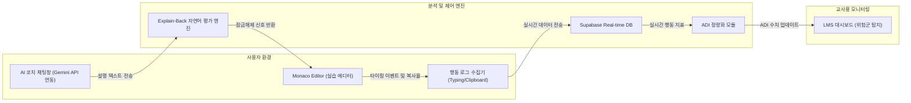

# [국책연구과제 제안형 기획서] MetaScaffold (메타스캐폴드)
> AI 의존형 학습저하(인지적 외주화) 방지를 위한 실시간 비계설정 및 학습관리 시스템 개발 및 구축 방법론

---

## 📄 제1장. 서론 (Introduction)

### 1.1. 연구개발의 목적 및 정의
본 연구개발은 생성형 AI(Generative AI)의 급격한 교육 현장 도입으로 발생하는 학습자의 **'인지적 외주화(Cognitive Offloading)'** 현상을 제어하고, 실시간 **비계설정(Scaffolding)** 기술을 통해 학습자의 자율적 문제 해결 능력을 보존·향상시키는 **AI 학습 관리 보조 시스템(LMS Agent)의 설계 및 구현 방안**을 제시하는 것을 목적으로 한다.

### 1.2. 핵심 연구개발 대상 및 범위
* **실시간 복사-붙여넣기 및 타이핑 패턴 수집 엔진**: 학습자가 코드 에디터(Sandbox) 내에서 텍스트를 입력하는 시간 간격(Typing Interval)과 클립보드를 통한 대량 텍스트 삽입 이벤트를 실시간 탐지하는 기술.
* **설명 유도형(Explain-Back) 의미론적 검증 시스템**: AI의 개념적 힌트를 바탕으로 수정한 코드에 대해, 학습자가 해당 코드의 작동 원리를 자연어로 설명하고 이를 실시간 평가하여 학습 흐름(잠금 해제)을 제어하는 프롬프트 엔진.
* **학습자별 AI 의존 지수(ADI) 정량화 알고리즘**: 수집된 입력 행동 데이터 및 AI 사용 로그를 종합하여 학습자의 AI 의존성을 수식화 및 시각화하는 기술.

---

## 📂 제2장. 선정 배경 및 필요성 (Background & Justification)

### 2.1. 기술적·사회적 추진 배경
* **생성형 AI 시대의 프로그래밍 교육 패러다임 전환**: 코딩 교육은 문법(Syntax)의 암기에서 논리적 설계(Logic Design) 및 디버깅 능력 배양으로 전환되고 있다. 그러나 현행 교육 플랫폼들은 생성형 AI를 단순 '해답 제공기'로 방치하여 교육 질적 하락을 초래하고 있다.
* **K-Digital Training(KDT) 등 국비지원 직업훈련의 한계**: 비대면 원격 교육 환경에서 학습자가 과제 결과물을 생성형 AI로 대리 수행하여 제출하더라도, 교사가 이를 사전에 선별하거나 개입할 방법이 부재하여 최종 수료자들의 실무 적격성이 심각하게 저하되는 문제를 안고 있다.

### 2.2. 기존 학술 및 시장의 한계점
* **기존 유사도/표절 감지 도구(MOSS 등)의 한계**: 결과물 코드를 상호 대조하는 방식은 생성형 AI가 매번 다르게 생성하는 코드 변칙성(Variability)을 잡아낼 수 없다.
* **상용 AI 튜터 플랫폼의 한계**: 학습 이탈률 방지(비즈니스 지표)에 초점을 맞추어 정답 코드를 즉시 떠먹여 줌으로써, 뇌의 고차원 인지 회로(임계적 사고 및 문제 해결력)를 무력화하고 있다.
* **교육적 백신의 부재**: 학습자가 AI와 **'생산적인 인지적 투쟁(Cognitive Struggle)'**을 벌이도록 강제하는 능동적 통제 시스템의 개발이 시급하다.

---

## 🛠️ 제3장. 적용 기술 및 아키텍처 (Core Technologies)

MetaScaffold는 학습 과정의 실시간 통제 및 분석을 위해 다음과 같은 3가지 원천 기술을 결합하여 구현한다.



### 3.1. 타이핑 패턴 기반 복사-붙여넣기 탐지 기술 (Behavioral Tracking)
* 학습자의 키보드 입력(KeyDown, KeyUp) 이벤트 간의 델타 시간($\Delta t$)을 측정하여 기준치 이하의 비정상적 초고속 텍스트 삽입 행위를 클립보드 붙여넣기(Paste)로 감지한다.
* 이를 통해 시스템 프론트엔드 레벨에서 **수동 입력(Manual Typing)**과 **외부 복사 코드(External Copy)**의 비중을 라인 단위로 계산한다.

### 3.2. 설명 유도형(Explain-Back) 자연어 분석 기술 (NLP Evaluation)
* 학습자가 코드 잠금을 해제하기 위해 입력한 한글 텍스트를 LLM(Gemini)에 전달, 사전에 설계된 **자연어 이해 평가 매트릭스**를 거쳐 검증한다.
* **프롬프트 템플릿(System Prompt)**:
  ```json
  {
    "task": "Evaluate if the student's explanation demonstrates logic comprehension.",
    "rules": [
      "No copy-pasting of prompt text.",
      "Check if the explanation contains core concepts: loop boundary, accumulation, pointer.",
      "Output format: { 'passed': boolean, 'reason': string }"
    ]
  }
  ```

### 3.3. AI 의존 지수 (ADI - AI Dependency Index) 수식 정의
학습자가 과제를 스스로 해결하려는 노력의 척도를 수치화하기 위해 다음과 같은 가중치 기반 알고리즘을 사용한다.

$$\text{ADI} = w_1 \cdot \left( \frac{L_{\text{copy}}}{L_{\text{total}}} \right) + w_2 \cdot \left( \frac{N_{\text{query}}}{N_{\text{compile}} + 1} \right) + w_3 \cdot \left( 1 - R_{\text{explain}} \right)$$

* $L_{\text{copy}}$: AI 또는 외부 소스로부터 복사된 코드 라인 수
* $L_{\text{total}}$: 최종 에디터에 남은 전체 코드 라인 수
* $N_{\text{query}}$: 과제 수행 중 AI에게 입력한 질문 횟수
* $N_{\text{compile}}$: 빌드/실행을 스스로 시도한 횟수
* $R_{\text{explain}}$: '자기 설명 검증' 초기 통과율 (1차 시도 성공률)
* 가중치 설정: $w_1 = 0.5, w_2 = 0.3, w_3 = 0.2$ (합계 1.0)

---

## 📈 제4장. 실현 가능성 및 개발 계획 (Feasibility & Development)

### 4.1. 기술적 실현 가능성 및 AI 가속 전략
* **서버리스 아키텍처 도입**: Supabase를 백엔드로 활용하여 데이터베이스 구축, 실시간 API 통신, 인증 시스템 구축 시간을 1~2시간 이내로 단축한다.
* **AI 페어 프로그래밍(Cursor, GitHub Copilot 등) 가속 전략**:
  * **프론트엔드 퍼블리싱 가속**: 주니어 개발자들은 Figma 시안을 바탕으로 Cursor AI에 "Tailwind CSS와 Shadcn UI를 활용해 대시보드 리액트 컴포넌트를 만들어줘"와 같은 지시를 수행하여 프론트엔드 코드 양산 속도를 3배 이상 끌어올린다.
  * **보일러플레이트 코드 제로화**: API 호출 및 DB CRUD를 위한 기본 코드를 AI로 자동 생성하여 디버깅 및 통합 시간을 대폭 절약한다.
  * **수직 슬라이스(Vertical Slice) 프로토타입 집중**: 1일차 12시간 제출을 위해 복잡한 예외 처리나 디자인 디테일은 배제하고, "복사 감지 ➔ 락(Lock) ➔ 설명 입력 ➔ 검증 통과 ➔ 교사용 대시보드 실시간 반영"이라는 **하나의 유기적인 핵심 기능 흐름(Core Flow)**만 완성하는 전략을 취한다.

### 4.2. 개발 마일스톤 및 6인 R&R (무박 2일 기준)

#### ⏳ 마일스톤 흐름 (총 20시간 개발, 12시간 내 1차 프로토타입 완성 목표)
1. **0~2시간 (설계 및 스키마)**: 백엔드 API 설계 및 Supabase 테이블 셋업 완료.
2. **2~8시간 (Core 개발)**: 에디터 락(Lock) 이벤트 바인딩 및 Gemini API 연동 완료. UI 레이아웃 완성.
3. **8~12시간 (1차 프로토타입 완성 및 제출)**: 에디터-백엔드-교사용 대시보드 연동 완료. **1일차 프로토타입 정상 동작 확인 및 영상 촬영.**
4. **12~18시간 (고도화 및 폴리싱)**: 설명 분석용 프롬프트 정교화, 차트 시각화 디테일 보정.
5. **18~20시간 (최종 검증)**: 발표 자료(PPT) 매핑 및 모의 피칭 테스트.

#### 👥 6인 역할 분담 (R&R)
* **팀장 (나) - 직업훈련교사 & 미드레벨 개발자 (PM & System Architect)**:
  * 전체 시스템 아키텍처 설계, Gemini API 핵심 검증 엔진 구현 및 프롬프트 엔지니어링 리드.
* **주니어 고급 개발자 (1명) - Full-Stack Integrator**:
  * Supabase 실시간 동기화 채널 및 에디터-백엔드 간의 API 브릿지 연결 총괄.
* **주니어 개발자 A (1명) - FE Developer (에디터 전담)**:
  * Monaco Editor 통합, 실시간 타이핑 속도 및 복사-붙여넣기 감지 UI 인터랙션 구현. (Cursor 활용)
* **주니어 개발자 B (1명) - FE Developer (대시보드 전담)**:
  * 교사용 대시보드 화면 및 차트 시각화 컴포넌트 구현. (Cursor 활용)
* **주니어 개발자 C (1명) - DB & Scenario Coordinator**:
  * Supabase 데이터베이스 셋업, AI 힌트용 모의 코딩 문제집 DB 시나리오 구축.
* **주니어 기획 D (1명) - PPT & Demo Video**:
  * 1일차 12시간 프로토타입 제출용 시연 비디오 녹화/편집, 최종 발표용 피칭 슬라이드 디자인 및 시나리오 작성.

---

## 📊 제5장. 정량적 및 정성적 평가 체계 (Evaluation Metrics)

성공적인 시스템 구축 방법론 검증을 위해 본 과제는 아래와 같은 평가 지표를 제시한다.

### 5.1. 정량적 목표치 및 평가 방법
1. **Explain-Back 문맥 평가 정확도**: LLM의 자연어 이해 판정 결과와 인간 교육자의 판독 결과 간 일치율 **85% 이상** 달성.
2. **복사 감지 실시간 오탐율**: 순수 수동 타이핑 중 클립보드로 잘못 인지되는 비율 **1% 미만**으로 통제.
3. **교사 대시보드 데이터 동기화 지연**: 학생의 코드 수정이 교사 화면에 반영되는 시간 **1초 이내(WebSocket 기술 적용)** 보장.

### 5.2. 정성적 평가지표 (만족도 및 인지적 유용성)
* **메타인지 자기효능감**: 훈련 수료생 대상 설문을 통해 AI 없이 스스로 구현할 수 있다는 '주체적 코딩 효능감' 개선 평가.
* **훈련교사 업무 피로도 경감**: 대규모 원격 교육 환경에서 개별 지도가 필요하지만 방치되어 있던 위험군 학생을 조기에 선별하는 직관성 평가.

---

## 🚀 제6장. 고도화 전략 및 확장 로드맵 (Advanced Roadmaps)

### 6.1. 표준 LMS 통합을 위한 LTI(Learning Tools Interoperability) 표준 준수
* 본 시스템은 독립형 앱에 그치지 않고, Canvas, Moodle, BlackBoard 등 글로벌 대학 및 교육 기관의 표준 LMS에 플러그인 형태로 즉시 삽입될 수 있도록 **LTI 1.3 표준 사양**을 적용하여 모듈화한다.

### 6.2. 어댑티브 비계설정 (Adaptive Scaffolding) 고도화
* 모든 훈련생에게 동일한 잠금 수준을 적용하는 대신, 훈련생의 실시간 ADI 트렌드에 따라 AI의 개입 강도를 자동으로 증감시킨다.
* **초심자 모드**: 힌트를 80% 주며, Explain-Back 핵심 키워드 매칭 기준을 낮게 설정.
* **숙련자 모드**: 힌트 차단율 90%, Explain-Back 검증 시 보다 엄격한 정형적 로직 기술 요구.

---

## 🌍 제7장. 사회적 기대효과 및 가치 창출 (Societal Impact)

### 7.1. 국가 소프트웨어(SW) 인재 풀의 질적 강화
* 생성형 AI의 그늘에 가려진 **'코드 짜깁기형 신입 개발자' 양산 현상을 방지**하고, 기술 변화 속에서도 독자적으로 문제를 해결하고 설계할 수 있는 실질적 핵심 인재를 양성한다.

### 7.2. 국비 교육 지원 사업의 투명성 및 효율성 증대
* 정부 예산이 투입되는 직업훈련 과정에서 훈련생들의 실질적 학습 성취율을 과학적으로 계량화하여, **국가 교육 재정의 세수 낭비를 막고 교육 사업의 효과적 정성 평가를 도출**할 수 있는 계량적 기준을 마련한다.
